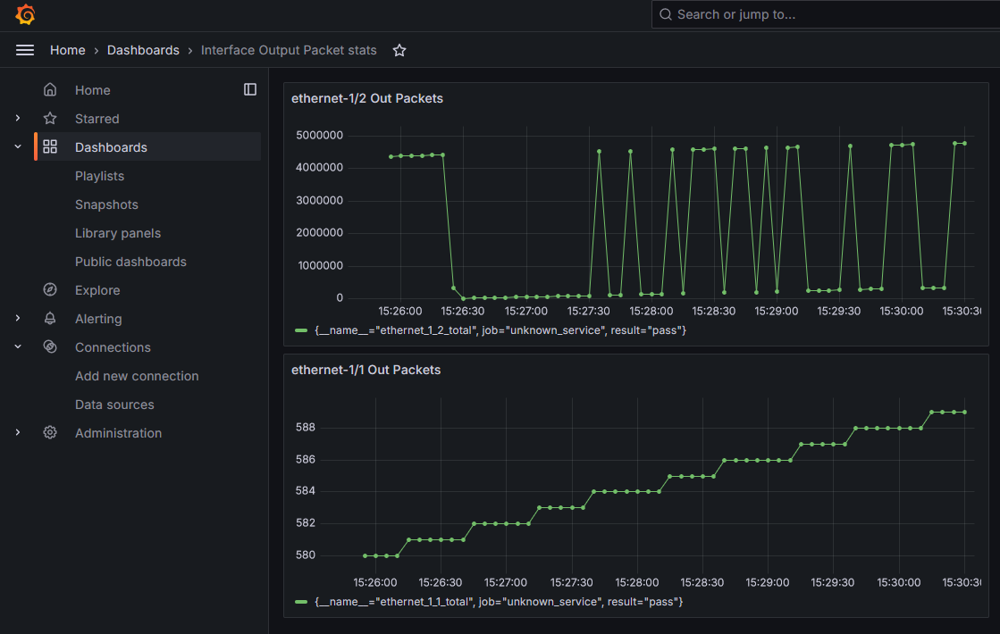
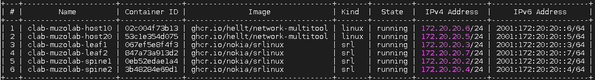

# My Demo

I prepared this demo to show how we can collect metrics from SRLINUX routers and generate charts at Grafana, after setting up the pipeline that leverages OpenTelemetry and Prometheus.

I developed a simple script metric_manager.py that grabs packets_out counters from interfaces (ethernet-1/1 and ethernet-1/2) every 5 secs using **gNMI**. 
The path where the metrics are stored can be discovered by the **YANG** model documentation of the SRLinux   
(https://yang.srlinux.dev/)  
The script then pushes that metrics towards the **OpenTelemetry Collector**.

The metrics are stored in Prometheus after which are be polled by Grafana.

Grafana Dashboard is as:

 

### Important Pre-requisites
Docker, Docker Compose and Containerlab must have been deployed.

Containerlab is a utility that provides a CLI for orchestrating and managing container-based networking labs. With presenting a topology file in yaml, one can easily build up the lab. Containerlab spins up routers and hosts as docker containers and creates the wiring  that interconnect them together.

You can find the installation steps for Containerlab at  
https://containerlab.dev/install/

## Demo Steps
**Install all required modules  **
> pip install -r requirements.txt  
  
**Clone the repo and navigate to the folder  **
> git clone https://github.com/muzafferkahraman/opentelemetry-with-srlinux  
> cd opentelemetry-with-srlinux  

**Deploy the leafs,spines and the hosts that generate the packets  **
> clab dep -t  /topology-files/muzolab.yml --reconfigure  

At the end you should see  

**Deploy Grafana,Prometheus and the OpenTelemetry Collector  **
> docker compose -f /topology-files/docker-compose.yml up  

**Trigger packets from host10 to host20  **
> docker exec -ti  clab-muzolab-host10 ping clab-muzolab-host20  

Finally, turn on the metric_manager.py  
> python3 metric_manager.py   

### Accessing to Grafana  

Grafana: http://localhost:3000  

#### Destroying the lab  
> clab des -t topology-files/muzolab.yml --cleanup  
> docker compose -f /topology-files/docker-compose.yml down  

