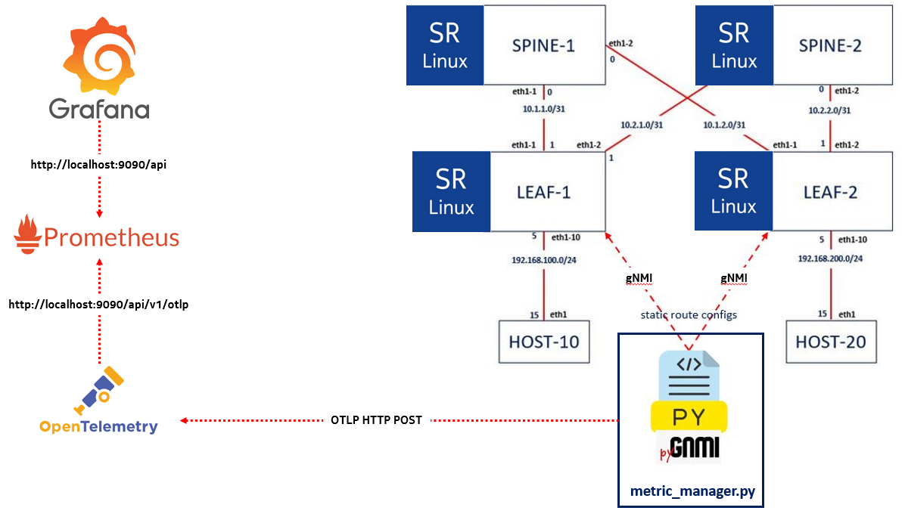

# My Demo

 

I prepared this demo to show how we can collect metrics from SRLINUX routers and generate charts at Grafana, after setting up the pipeline that leverages OpenTelemetry and Prometheus.

I developed a simple script metric_manager.py that grabs packets_out counters from interfaces (ethernet-1/1 and ethernet-1/2) every 5 secs using gNMI. The path where the metrics are stored can be discovered by the YANG model documentation of the SRLinux (https://yang.srlinux.dev/). The script then pushes that metrics towards the OpenTelemetry Collector.

The metrics are stored in Prometheus after which will be polled by Grafana.

Grafana Dashboard is as:

 

 

**Here are the steps for the demo**

### Important Pre-requisites
Docker, Docker Compose and Containerlab must have been deployed.

Containerlab is a utility that provides a CLI for orchestrating and managing container-based networking labs. With presenting a topology file in yaml, one can easily build up the lab. Containerlab spins up routers and hosts as docker containers and creates the wiring  that interconnect them together.

You can find the installation steps for Containerlab at: 
https://containerlab.dev/install/

> git clone https://github.com/muzafferkahraman/network_automation_demo  
> cd network_automation_demo  
> clab deploy -t lab_deploy.yml --reconfigure  

### Testing connectivity between the hosts
> docker exec -ti host10 ping 192.168.200.15  
> docker exec -ti host20 ping 192.168.100.15  

### Run the python code to push the missing static route configs
> python3 gnmi_push_config.py 

### Pre-requisite
You need to deploy containerlab, beforehands to run this lab

To install containerlab (CentOS 7)
> yum-config-manager --add-repo=https://yum.fury.io/netdevops/ && echo "gpgcheck=0" | 
> sudo tee -a /etc/yum.repos.d/yum.fury.io_netdevops_.repo  
> yum install containerlab

for other distros, please refer to 
https://containerlab.dev/install/

Prometheus: http://localhost:9090
Grafana: http://localhost:3000
OpenTelemetry Collector:
http://localhost:55679/debug/tracez
http://localhost:1777/debug/pprof/

